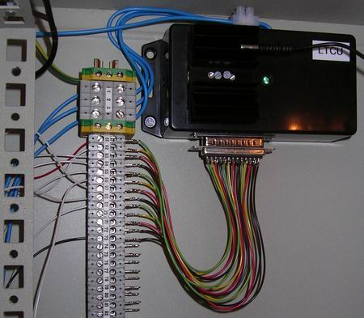

## Source code for project: [Stack lights and horn controller](https://link.stdout.no/f)

This is the [Rack box](https://link.stdout.no/C) alarm handling unit. It controls the stack light, strobes and horn. Uses an AVR ATtiny2313 microcontroller.

Written in basic, using [Bascom-AVR](http://www.mcselec.com/).

### Author
[Thomas Jensen](https://thomas.stdout.no)
